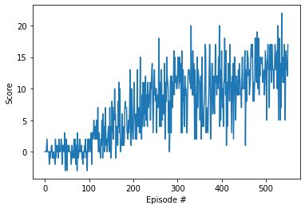

# P1 Navigation Report

## Project's goal

In this project, **the goal is to train an agent to navigate a virtual world and collect as many yellow bananas as possible while avoiding blue bananas**


## Environment details

The environment is based on [Unity ML-agents](https://github.com/Unity-Technologies/ml-agents)

Note: The project environment provided by Udacity is similar to, but not identical to the Banana Collector environment on the Unity ML-Agents GitHub page.

> The Unity Machine Learning Agents Toolkit (ML-Agents) is an open-source Unity plugin that enables games and simulations to serve as environments for training intelligent agents. Agents can be trained using reinforcement learning, imitation learning, neuroevolution, or other machine learning methods through a simple-to-use Python API. 

A reward of +1 is provided for collecting a yellow banana, and a reward of -1 is provided for collecting a blue banana. Thus, the goal of the agent is to collect as many yellow bananas as possible while avoiding blue bananas.

The state space has 37 dimensions and contains the agent's velocity, along with ray-based perception of objects around the agent's forward direction. 

Given this information, the agent has to learn how to best select actions. Four discrete actions are available, corresponding to:

- 0 - move forward.
- 1 - move backward.
- 2 - turn left.
- 3 - turn right.

The task is episodic, and **in order to solve the environment, the agent must get an average score of +13 over 100 consecutive episodes.**


## Agent Implementation

Originally this project was implemented using the Deep Q-Network algorithm described in the section bellow.  However even though the ajent reached its target of a positive score of thirteen in under 1700 epochs, the author found that the results were unsatisfactory with a with a consistent large variation in the avarage rolling mean score of 100 epochs. So the final implementation submitted here uses Double Deep Q-Networks with as a variation o the Deep Q-Network algorithm, described in its section bellow. This algorith provided significant improvements in both the number of epochs required to achive the target score of thirteen as well as a a reduction in the variation of the avarage rolling mean score of 100 epochs to, in the view of the author, acceptable levels.  Thus the algorith is quick to converge and also stable.

### Deep Q-Networks

This project was originally implemented as a *Value Based* method called [Deep Q-Networks](https://deepmind.com/research/dqn/).  

Deep Q Learning combines 2 approaches :
- A Reinforcement Learning method called [Q Learning](https://en.wikipedia.org/wiki/Q-learning) (aka SARSA max)
- A Deep Neural Network to learn a Q-table approximation (action-values)

This implementation includes the 2 major training improvements by [Deepmind](https://deepmind.com) and described in their [Nature publication : "Human-level control through deep reinforcement learning (2015)"](https://storage.googleapis.com/deepmind-media/dqn/DQNNaturePaper.pdf)
- Experience Replay 
- Fixed Q Targets

> Reinforcement learning is known to be unstable or even to diverge when a nonlinear function approximator such as a neural network is used to represent the action-value (also known as Q) function20. This instability has several causes: the correlations present in the sequence of observations, the fact that small updates to Q may significantly change the policy and therefore change the data distribution, and the correlations
between the action-values and the target values .
I addressed these instabilities with a variant of Q-learning, which uses two key ideas. First, I used a mechanism termed experience replay that randomizes over the data, thereby removing correlations in the observation sequences and smoothing over changes in the data distribution. Second, I used an iterative update that adjusts the action-values towards target values that are only periodically updated, thereby reducing correlations with the target.

The programatic implementation of this agorithm can be found in the (DQN) *agent* class method *learn* situated in the *dqn_agent.py* file.

### Double Deep Q-Networks

- [Double DQN](https://arxiv.org/abs/1509.06461)
> This paper highlights the followig:
- The popular Q-learning algorithm is known to overestimate action values under certain conditions. 
- It was not previously known whether, in practice, such overestimations are common, whether they harm performance, and whether they can generally be prevented. This paper answer all these questions affirmatively. 
- In particular, it first shows that the recent DQN algorithm, which combines Q-learning with a deep neural network, suffers from substantial overestimations in some games in the Atari 2600 domain. 
- It then show that the idea behind the Double Q-learning algorithm, which was introduced in a tabular setting, can be generalized to work with large-scale function approximation. 
- It proposes a specific adaptation to the DQN algorithm and show that the resulting algorithm not only reduces the observed overestimations, as hypothesized, but that this also leads to much better performance on several games.


### Algorithm

Based on the above paper the author implemented the following Double Deep Q-Network algorithm, with some of the modifications suggested in 'Grokking Deep Reinforcement Learning Meap v12' chapter 9.3.5, section 'Its in the Detail: The full Double Deep Q-Network (DDQN) algorithm'

- Approximate the action-value function Q(s,a; θ). ·  
- Use a state-in-values-out architecture (nodes: 37, 512, 256, 128, 4). ·  
- Optimize the action-value function to approximate the optimal actionvalue function q*(s,a). ·  
- Use off-policy TD targets (r + gamma*max_a’Q(s’,a’; θ)) to evaluate policies. ·  
- Use Adam Optimizer as our optimizer with a learning rate of 0.0007. Note that before I used 0.0005 because without double learning (vanilla DQN) some seeds fail if I train with a learning rate of 0.0007. Perhaps stability? 
*In DDQN, on the other hand, training with a higher learning rate works best*
- An exponentially decaying epsilon-greedy strategy (from 1.0 to 0.3 in roughly 2,000 steps) to improve policies. ·  
- A replay buffer with 100 samples min, 100,000 max, and a batch of 64. ·  
- A target network that freezes for 15 steps and then updates fully. DDQN, just like DQN has the same 3 main steps: 
    1. Collect experience: (St, At, Rt+1, St+1, Dt+1), and insert it into the replay buffer. 
    2. Randomly sample a mini-batch from the buffer and calculate the off-policy TD targets for the whole
    batch: r + gamma*max_a’Q(s’,a’; θ). 
    3. Fit the action-value function Q(s,a; θ): Using Adam Optimizer.   


### Code implementation

The code used here is derived from the "Lunar Lander" tutorial from the [Deep Reinforcement Learning Nanodegree](https://www.udacity.com/course/deep-reinforcement-learning-nanodegree--nd893), and has been adjusted to be used with the banana environment.

The code consist of :

- model.py : In this python file, a PyTorch QNetwork class is implemented. This is a regular fully connected Deep Neural Network using the [PyTorch Framework](https://pytorch.org/docs/stable/). This network will be trained to predict the action to perform depending on the environment's observed states. This Neural Network is used by the DQN agent and is composed of :
  - the input layer which size depends of the state_size parameter passed in the constructor (37). There are 37 dimensions in the imput state space.
  - 4 hidden fully connected layers of [512, 256, 128, 64]  cells respectivly.
  - the output layer which size depends on the action_size parameter passed in the constructor (4), here there are 4 possible actions.
- dqn_agent.py : In this python file, a DQN agent and a Replay Buffer memory used by the DQN agent) are defined.
  - The DQN agent class is implemented, as described in the Double Deep Q-Learning algorithm. It provides several methods :
    - constructor : 
      - Initialize the memory buffer (*Replay Buffer*)
      - Initialize 2 instance of the Neural Network : the *target* network and the *local* network
    - step() : 
      - Allows to store a step taken by the agent (state, action, reward, next_state, done) in the Replay Buffer/Memory
      - if there are enough samples available in the Replay Buffer:
        - calls DDQN_learn() to implement the agorithm.
        - Every 15 steps (this is configurable), update the *target* network weights with the current weight values from the *local* network (That's part of the Fixed Q Targets technique)
    - act() : returns actions for the given state as per current policy (Note : The action selection uses an Epsilon-greedy selection so as to balance between *exploration* and *exploitation* for the Q Learning)
    - learn() a legasy method that uses the Deep Q-Networks algorithm and updates the Neural Network value parameters using a given batch of experiences from the Replay Buffer. 
    - DDQN_learn() : method that uses the Double Deep Q-Networks algorithm and updates the Neural Network value parameters using a given batch of experiences from the Replay Buffer. 
    - soft_update() : called by learn() to softly updates the value from the *target* Neural Network from the *local* network weights (That's part of the Fixed Q Targets technique) NB this soft update technique is a spin off from the "Lunar Lander" code and is not used by the DDQN_learn methode, as the *target* Neural Network is updated every 15 steps from the step() method via the update_network() method.
    - update_network() : the *target* Neural Network update method that copies the weights of the *local* network to the *target*
    - save_model() : saves the following checkpoint:
        'input_size':  state space,
        'output_size': action space,
              'hidden_layers': [each.in_features for each in self.qnetwork_local.hidden_layers],
              'state_dict': qnetwork_local.state_dict(),
              'optimizer_state_dict': this is required because we are using the Adam optimizer,
              'epoch': epoch (number of epoch so far),
              'avarage_score': mean score of last 100 epochs.
    - load_model() : loads a specified checkpoint file and continues training from the last epoch.
  - The ReplayBuffer class implements a fixed-size buffer to store experience tuples  (state, action, reward, next_state, done) 
    - add() allows to add an experience step to the memory
    - sample() allows to randomly sample a batch of experience steps for the learning       
- P1_navigation_DDQN_01.ipynb : This Jupyter notebooks to train the agent. It allows:
  - Import of the Necessary Packages 
  - Examination of the State and Action Spaces
  - Take Random Actions in the Environment
  - Train an agent using DDQN
  - Save the chechpoint every 100 episodes
  - Plot the scores
  - saves the final state_dict weights

### Configuration used 

The agent has been trained on the following:
```
Hardware:
    Device name : Gigabyte AERO 15,
    Memory : 31.2 GiB,
    Processor : Intel® Core™ i7-8750H CPU @ 2.20GHz × 12,
    Graphics : GeForce RTX 2070 with Max-Q Design/PCIe/SSE2,
    OS type : 64-bit,

Software :
    OS : Ubuntu 18.04.4 LTS 64-bit,
    Cuda : 10.1
    python  3.6
    pytorch 1.5
```
This environment allows to use a GeForce RTX 2070 GPU for the training. 


### DDQN parameters and results

The DQN agent uses the following parameters values (defined in dqn_agent.py)

```
BUFFER_SIZE = int(1e5)  # replay buffer size
BATCH_SIZE = 64         # minibatch size
GAMMA = 0.99            # discount factor
TAU = 1e-3              # for soft update of target parameters
LR = 7e-4               # learning rate 
UPDATE_EVERY = 15       # how often to update the network
dropout rate = 0.2      # dropout probability during training
```

The Neural Networks use the following architecture :

```
Input nodes (37) -> Fully Connected Layer (512 nodes, Relu activation, dropout) 
                 -> Fully Connected Layer (256 nodes, Relu activation, dropout) 
                 -> Fully Connected Layer (128 nodes, Relu activation, dropout)
                 -> Fully Connected Layer (64 nodes, Relu activation, dropout)
                 -> Ouput nodes (4)
```

The Neural Networks use the Adam optimizer with a learning rate LR=7e-4 and are trained using a BATCH_SIZE=64

Given the chosen architecture and parameters, our results are :

```
Trainning log:
seed  666   self.seed  213  # To randomise the seed used to create the environment, initial network weights and random selection processes an initial 'seed' was used to select a random seed from 0 to 'seed'
[512, 256, 128, 64]         # dimetions of the network hidden layers
buffer size  100000         # size of the ReplayBuffer

Average rolling mean score each epoch: 
Episode 100	Average Score: 0.10
Episode 200	Average Score: 3.40
Episode 300	Average Score: 8.13
Episode 400	Average Score: 9.82
Episode 500	Average Score: 11.51
Episode 551	Average Score: 13.06

Environment solved in 551 episodes! Average Score: 13.06
```

[Score evolution during the training


**These results meets the project's expectation as the agent is able to receive an average reward (over 100 episodes) of at least +13, and in 551 episodes only** (In comparison, according to Udacity's solution code for the project, their agent was benchmarked to be able to solve the project in fewer than 1800 episodes)

### Ideas for future work

As discussed in the Udacity Course, a further evolution to this project would be to train the agent directly from the environment's observed raw pixels instead of using the environment's internal states (37 dimensions)

To do so a [Convolutional Neural Network](https://en.wikipedia.org/wiki/Convolutional_neural_network) would be added at the input of the network in order to process the raw pixels values (after some little preprocessing like rescaling the image size, converting RGB to gray scale, ...)

Other enhancements might also be implemented to increase the performance of the agent:
- [Dueling DQN](https://arxiv.org/abs/1511.06581)
> In recent years there have been many successes of using deep representations in reinforcement learning. Still, many of these applications use conventional architectures, such as convolutional networks, LSTMs, or auto-encoders. In this paper, we present a new neural network architecture for model-free reinforcement learning. Our dueling network represents two separate estimators: one for the state value function and one for the state-dependent action advantage function. The main benefit of this factoring is to generalize learning across actions without imposing any change to the underlying reinforcement learning algorithm. Our results show that this architecture leads to better policy evaluation in the presence of many similar-valued actions. Moreover, the dueling architecture enables our RL agent to outperform the state-of-the-art on the Atari 2600 domain.

- [Prioritized experience replay](https://arxiv.org/abs/1511.05952)
> Experience replay lets online reinforcement learning agents remember and reuse experiences from the past. In prior work, experience transitions were uniformly sampled from a replay memory. However, this approach simply replays transitions at the same frequency that they were originally experienced, regardless of their significance. In this paper we develop a framework for prioritizing experience, so as to replay important transitions more frequently, and therefore learn more efficiently. We use prioritized experience replay in Deep Q-Networks (DQN), a reinforcement learning algorithm that achieved human-level performance across many Atari games. DQN with prioritized experience replay achieves a new state-of-the-art, outperforming DQN with uniform replay on 41 out of 49 games.
